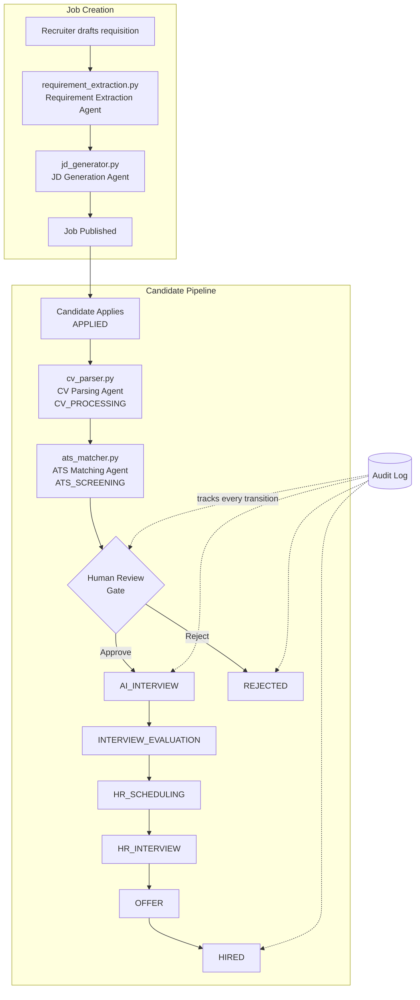

<div align="center">


# Hirely

**Agentic AI Recruitment Operating System**

A full-stack platform that takes a job requisition from draft to hire, powered by a multi-agent LLM pipeline for CV parsing, ATS-style candidate matching, and job description generation — with a human-in-the-loop gate at every consequential decision.

[](#tech-stack)
[](#tech-stack)
[](#tech-stack)
[](#tech-stack)
[](#license)

[Overview](#overview) •
[Agent Architecture](#agent-architecture) •
[Features](#features) •
[Tech Stack](#tech-stack) •
[Getting Started](#getting-started) •
[API Overview](#api-overview) •
[Testing](#testing) •
[Roadmap](#roadmap)

</div>

---

## Overview

Recruitment teams typically run a fragmented, manual pipeline: job descriptions written by hand, CVs screened by eye or by primitive keyword filters, interview scheduling handled over email, and inconsistent candidate communication. Most "AI ATS" tools bolt AI onto a single stage — parsing, or scoring — and leave the rest of the pipeline manual and disconnected.

**Hirely** is different: it's an AI-native recruitment operating system that orchestrates the *full* hiring lifecycle through a set of coordinated, specialized AI agents working under human supervision.

- **Recruiters** create jobs from a plain-language description, get an explainable, evidence-backed ranking of applicants, and retain final decision authority at every gate.
- **Candidates** get a fast, transparent application experience and clear status updates throughout.
- **The system** never lets an agent autonomously reject or hire a candidate — every consequential transition requires a logged human decision, and every AI recommendation ships with human-readable evidence.

Screenshots, the full data model, and the phased delivery plan live in [`Hirly_Project_Description_and_SRS.md`](./Hirly_Project_Description_and_SRS.md).

<p align="center">
  
</p>

---

## Agent Architecture

Each requisition and application moves through a pipeline of LLM-backed agents, orchestrated by `orchestrator/engine.py` and routed through a shared `app/core/agent_llm_client.py` (Groq / OpenRouter).



| Agent | File | Responsibility |
|---|---|---|
| **Requirement Extraction Agent** | `app/agents/requirement_extraction.py` | Turns a recruiter's raw requisition text into structured role requirements (title, experience range, required/preferred skills, responsibilities). |
| **JD Generation Agent** | `app/agents/jd_generator.py` | Produces the full, editable job description from the extracted requirements. |
| **CV Parsing Agent** | `app/agents/cv_parser.py` | Parses an uploaded resume (PDF/DOCX) into a structured candidate profile — education, experience, skills, projects, certifications, languages, links. |
| **ATS Matching Agent** | `app/agents/ats_matcher.py` | Scores the parsed candidate against the role's requirements across multiple dimensions and produces the evidence shown on the human-review screen. |

**Orchestrator (`orchestrator/engine.py`)** drives every stage transition through the candidate finite-state machine and writes an audit-log entry for each one, so the full application timeline — for either the `HIRED` or `REJECTED` path — can be reconstructed on demand.

### Candidate State Machine

```
APPLIED
  → CV_PROCESSING
     → ATS_SCREENING
        → HUMAN_REVIEW ──(reject)──► REJECTED
           → AI_INTERVIEW
              → INTERVIEW_EVALUATION
                 → HR_SCHEDULING
                    → HR_INTERVIEW
                       → OFFER
                          → HIRED
```

No candidate can reach `REJECTED` or `HIRED` without a logged human decision tied to a specific reviewer and timestamp.

---

## Features

- 🧑‍💼 **Recruiter console** — register an org, draft and publish job requisitions, and work an application queue through a human-review gate.
- 🌐 **Public careers site** — no-auth job listing and detail pages, a resume-upload application flow, and application-status lookup by reference number.
- 🤖 **Multi-agent LLM pipeline** — requirement extraction, CV parsing, ATS matching, and job description generation, each backed by real LLM calls (Groq by default, OpenRouter supported) via a shared agent client.
- 🔁 **Full candidate pipeline** — `APPLIED → CV_PROCESSING → ATS_SCREENING → HUMAN_REVIEW → AI_INTERVIEW → INTERVIEW_EVALUATION → HR_SCHEDULING → HR_INTERVIEW → OFFER → HIRED`, with a `REJECTED` branch off human review and a full audit-log timeline for either path.
- 📊 **Explainable scoring** — every ATS match ships with per-dimension scores plus a human-readable evidence sentence, never a bare percentage.
- 🔐 **JWT auth**, org-scoped access, and a CORS-configured API for the frontend.
- 🗂️ **Auditability by design** — every state transition and every agent execution is logged for later reconstruction.

---

## Tech Stack

| Layer | Choice |
|---|---|
| **Frontend** | Next.js 14 (App Router), TypeScript, Tailwind CSS |
| **Backend** | FastAPI, Pydantic, SQLAlchemy + Alembic |
| **AI / Agents** | Groq / OpenRouter LLM providers via a shared agent client (`app/core/agent_llm_client.py`) |
| **Database** | PostgreSQL (`pgvector`) |
| **Queue / Infra** | Redis, Docker Compose |
| **Auth** | JWT, org-scoped RBAC |

---

## Getting Started

### Option A — Docker (recommended)

The whole stack (Postgres, Redis, API) runs via Compose.

1. Copy `.env.example` to `.env` at the project root and fill in real values:

   | Variable | Description |
   |---|---|
   | `JWT_SECRET` | Any long random string for local dev |
   | `GROQ_API_KEY` / `OPENROUTER_API_KEY` | Required — every agent in `app/agents/` calls out via `app/core/agent_llm_client.py` |
   | `LLM_PROVIDER` | Picks the backend: `groq` \| `openrouter` |
   | `FRONTEND_ORIGINS_RAW` | Comma-separated origins allowed to call the API (CORS). Defaults to `http://localhost:3000` |

2. Build and start everything:

   ```bash
   docker compose up --build
   ```

   This starts Postgres (`pgvector/pgvector:pg16`) and Redis with health checks, then builds the API image and runs `alembic upgrade head` automatically before starting `uvicorn`.

3. API docs are served at **http://localhost:8000/docs**.

### Option B — API on the host

```bash
cd Backend
python -m venv .venv && source .venv/bin/activate
pip install -r requirements.txt
docker compose up -d db redis
alembic upgrade head
uvicorn app.main:app --reload
```

Docs at **http://localhost:8000/docs**.

### Frontend

```bash
cd Frontend
npm install
cp .env.example .env.local   # NEXT_PUBLIC_API_URL, defaults to http://localhost:8000
npm run dev
```

Runs at **http://localhost:3000**:

| Route | Description |
|---|---|
| `/`, `/login`, `/register`, `/dashboard/**` | Recruiter console. Register creates a new org (you become its `admin`); sign in to draft requisitions, publish job descriptions, and work the human-review gate. |
| `/careers`, `/careers/[jobId]`, `/apply/status` | Public candidate side. Lists open jobs, lets a candidate apply with a resume upload, and gives them an application number to check status with. |

For a production build: `npm run build && npm start`.

---

## API Overview

The frontend consumes the API in `Backend/app/api/routes/` using JWT bearer auth (from `/auth/login` or `/auth/register`). Key endpoints:

| Method & Path | Purpose |
|---|---|
| `GET /jobs/public`, `GET /jobs/{id}/public` | Unauthenticated job listing for the careers site |
| `GET /jobs/{id}`, `GET /jobs/{id}/applications` | Recruiter dashboard job detail and applicant queue |
| `GET /applications/{id}/review`, `POST /applications/{id}/review` | Human-review gate, including parsed candidate profile and ATS evidence |
| `POST /applications/{id}/advance` | Moves an application through the pipeline |
| `/auth/*` | Register / login |
| `/jobs/` | Create / approve jobs |
| `/apply/*` | Candidate application flow |
| `/candidates/{id}/profile` | Structured candidate profile |

Full request/response schemas are available at `/docs` (Swagger) once the API is running.

---

## Database Migrations

```bash
alembic revision --autogenerate -m "describe the change"
alembic upgrade head
```

---

## Testing

Each agent has a standalone smoke-test script that calls it directly (no DB, no server) — useful for checking your LLM provider key is wired up:

```bash
python test_requirement_extraction.py
python test_cv_parser.py
python test_ats_matcher.py
python test_jd_generator.py
```

The full candidate lifecycle has been verified end-to-end against a live server:

```
register org/user → create job → publish → candidate applies →
CV parsing → ATS screening → human review (approve or reject) →
interview → scheduling → offer → hired
```

...with the audit log reconstructing the full timeline for the run.


---

## License

MIT — see [`LICENSE`](./LICENSE) for details.
